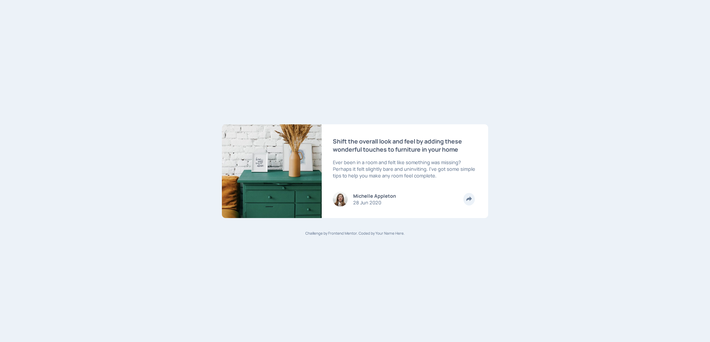
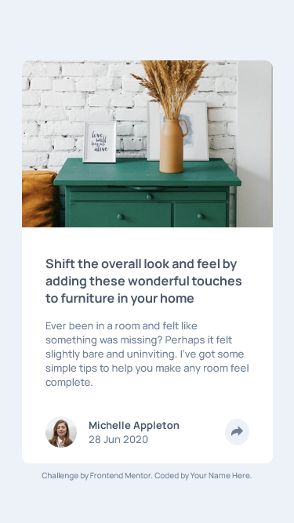

# Frontend Mentor - Article preview component solution

This is a solution to the [Article preview component challenge on Frontend Mentor](https://www.frontendmentor.io/challenges/article-preview-component-dYBN_pYFT). Frontend Mentor challenges help you improve your coding skills by building realistic projects. 

## Table of contents

- [Overview](#overview)
  - [The challenge](#the-challenge)
  - [Screenshot](#screenshot)
  - [Links](#links)
- [My process](#my-process)
  - [Built with](#built-with)
- [Author](#author)

## Overview

### The challenge

Users should be able to:

- View the optimal layout for the component depending on their device's screen size
- See the social media share links when they click the share icon

### Screenshot

### Links

- Solution URL: [https://github.com/RTX3070/fem-challenges/tree/master/article-preview-component](https://github.com/RTX3070/fem-challenges/tree/master/article-preview-component)
- Live Site URL: [https://codepen.io/rtx3070/pen/PoOPVgE](https://codepen.io/rtx3070/pen/PoOPVgE)

## My process

### Built with

- Semantic HTML5 markup
- CSS
- Flexbox

## Author

- CodePen - [@RTX3070](https://codepen.io/rtx3070)
- GitHub - [@RTX3070](https://github.com/RTX3070)
- Frontend Mentor - [@RTX3070](https://www.frontendmentor.io/profile/RTX3070)