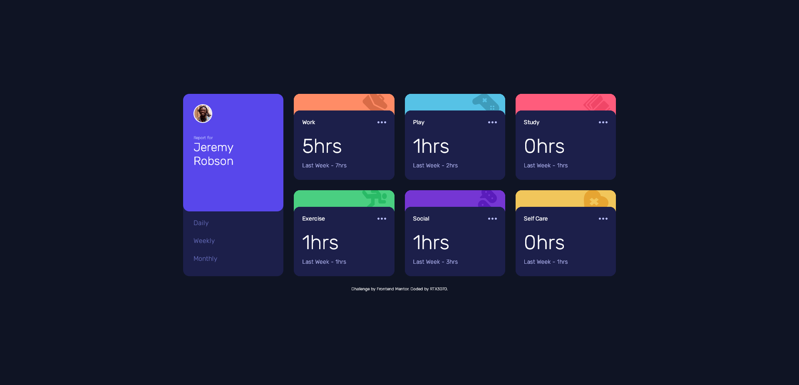
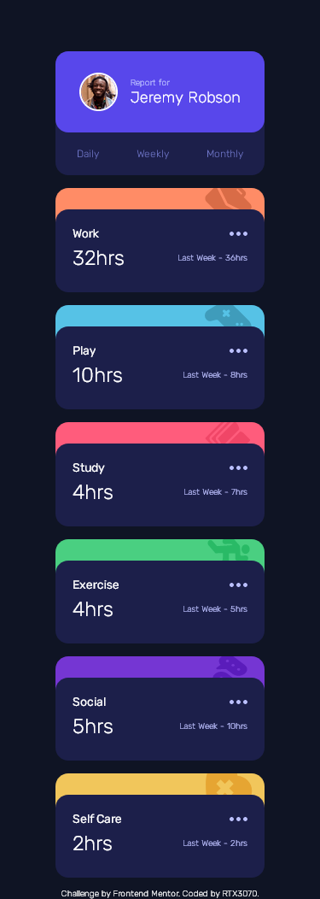

# Frontend Mentor - Time tracking dashboard solution

This is a solution to the [Time tracking dashboard challenge on Frontend Mentor](https://www.frontendmentor.io/challenges/time-tracking-dashboard-UIQ7167Jw). Frontend Mentor challenges help you improve your coding skills by building realistic projects. 

## Table of contents

- [Overview](#overview)
  - [The challenge](#the-challenge)
  - [Screenshot](#screenshot)
  - [Links](#links)
- [My process](#my-process)
  - [Built with](#built-with)
- [Author](#author)
- [Acknowledgments](#acknowledgments)
- [Sidenotes](#sidenotes)

## Overview

### The challenge

Users should be able to:

- View the optimal layout for the site depending on their device's screen size
- See hover states for all interactive elements on the page
- Switch between viewing Daily, Weekly, and Monthly stats

### Screenshot

### Links

- Solution URL: [Add solution URL here](https://your-solution-url.com)
- Live Site URL: [https://codepen.io/rtx3070/pen/bGYNVQe](https://codepen.io/rtx3070/pen/bGYNVQe)

## My process

### Built with

- Semantic HTML5 markup
- CSS
- Flexbox
- CSS Grid
- Mobile-first workflow
- JavaScript

## Author

- CodePen - [@RTX3070](https://codepen.io/rtx3070)
- Frontend Mentor - [@RTX3070](https://www.frontendmentor.io/profile/RTX3070)
- GitHub - [@RTX3070](https://github.com/RTX3070)

## Sidenotes

Solution hosted on CodePen differ a bit from the one hosted on GitHub because on the former, well, you can't fetch data from a file hosted locally on your machine.